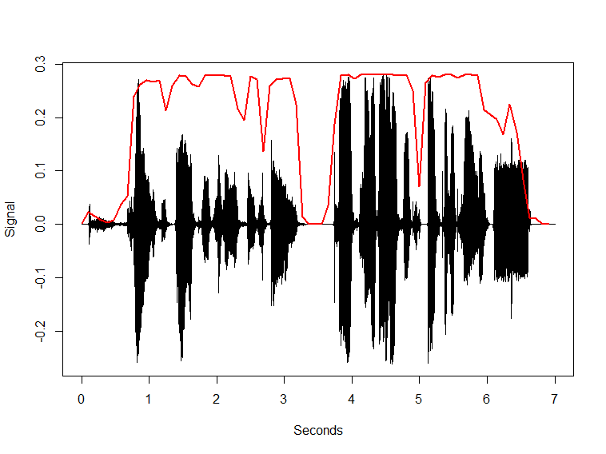

# audio.vadsilero

This repository contains an R package which is a torch R wrapper around the [Silero](https://github.com/snakers4/silero-vad) Voice Activity Detection model.

The package was created with as main goal to remove non-speech audio segments before doing an automatic transcription using [audio.whisper](https://github.com/bnosac/audio.whisper) to avoid transcription hallucinations. It contains

- functions to detect the location of voice in audio using a the .jit model from Silero implemented in [torch](https://github.com/snakers4/silero-vad)
- it has similar functionality as [audio.vadwebrtc](https://github.com/bnosac/audio.vadwebrtc)

### Installation

- The package is currently not on CRAN
- For the *development* version of this package: `remotes::install_github("bnosac/audio.vadsilero")`

Look to the documentation of the functions: `help(package = "audio.vadsilero")`

## Example

Get a audio file in 16 bit with mono PCM samples (pcm_s16le codec) with a sampling rate of either 8Khz, 16KHz or 32Khz 

```{r}
library(audio.vadsilero)
file <- system.file(package = "audio.vadsilero", "extdata", "test_wav.wav")
vad  <- silero(file, milliseconds = 96)
vad
Voice Activity Detection 
  - file: D:/Jan/R/win-library/4.1/audio.vadsilero/extdata/test_wav.wav 
  - sample rate: 16000 
  - VAD type: silero, VAD mode: , VAD by milliseconds: 96, VAD frame_length: 1536
    - Percent of audio containing a voiced signal: 76.6% 
    - Seconds voiced: 4.7 
    - Seconds unvoiced: 1.4 
vad$vad_segments
 vad_segment start   end has_voice
           1 0.000 0.672     FALSE
           2 0.768 2.592      TRUE
           3 2.688 2.688     FALSE
           4 2.784 3.168      TRUE
           5 3.264 3.648     FALSE
           6 3.744 4.896      TRUE
           7 4.992 4.992     FALSE
           8 5.088 6.432      TRUE
           9 6.528 6.912     FALSE
```

Example of a simple plot of these audio and voice segments

```{r}
library(wav)
x <- read_wav(file)
plot(seq_along(x) / 16000, x, type = "l", xlab = "Seconds", ylab = "Signal")
lines(vad$vad$millisecond / 1000, vad$vad$probability *  max(x), type = "l", col = "red", lwd = 2)
```




## Support in text mining

Need support in text mining?
Contact BNOSAC: http://www.bnosac.be


